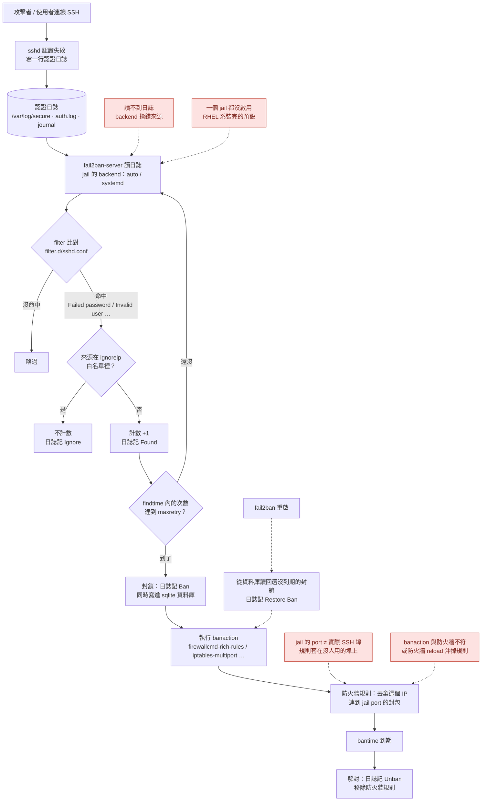
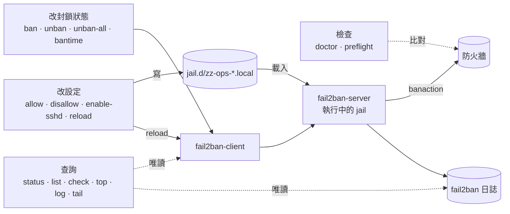
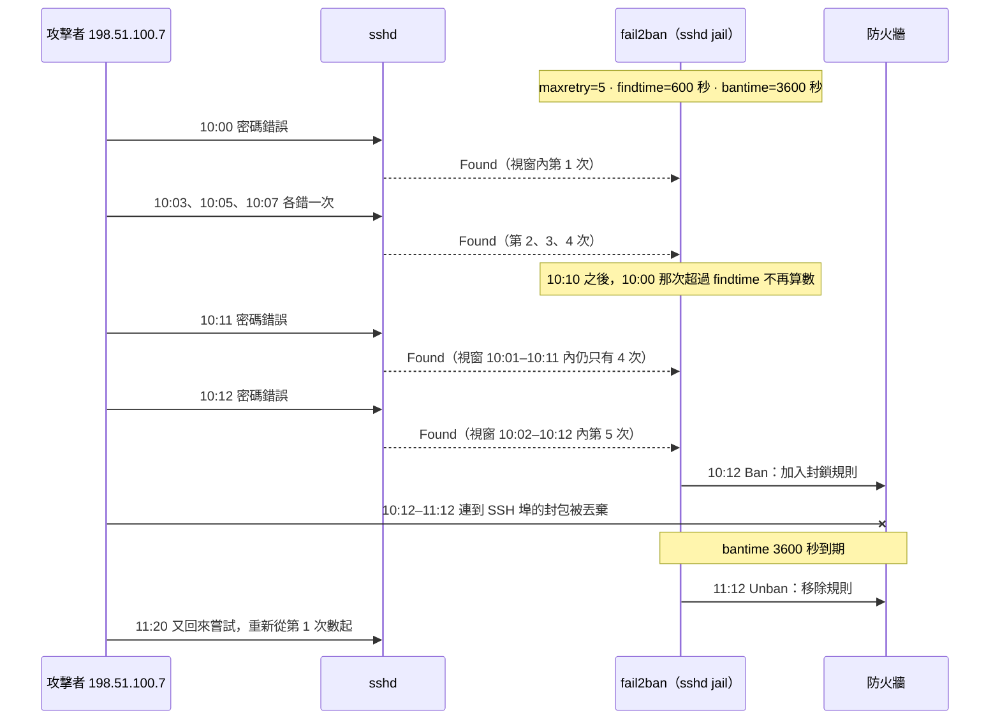

# FAIL2BAN/

`fail2ban.sh` — fail2ban 的封鎖管理介面：手動封鎖 / 解封、白名單、排行、環境檢查。

可以透過根目錄的 [`../ops.sh`](../README.md) 選單操作（主選單按 `b`），以下是直接呼叫的說明。

| | |
|---|---|
| Shell | POSIX sh（Alpine 的 busybox ash 可直接執行） |
| 需要 root | 是（fail2ban 的控制 socket 只有 root 能用），`doctor` / `-h` 除外 |
| 會改系統嗎 | 會：封鎖狀態（透過 fail2ban-client）與 `jail.d/zz-ops-*.local` 兩個設定檔 |
| 相依 | fail2ban 本身；沒裝可以用 `install` 裝 |

```bash
./fail2ban.sh status              服務與各 jail 的封鎖概況
./fail2ban.sh list [jail]         列出已封鎖的 IP
./fail2ban.sh ban <IP…>           手動封鎖（預設所有 jail）
./fail2ban.sh unban <IP…>         解除封鎖（自動找出哪些 jail 封了它）
./fail2ban.sh unban-all           清空封鎖清單
./fail2ban.sh check <IP>          查這個 IP 現在的狀態
./fail2ban.sh allow <IP…>         加白名單（ignoreip）
./fail2ban.sh disallow <IP…>      移除白名單
./fail2ban.sh top [n]             封鎖次數最多的來源
./fail2ban.sh log [n]             最近的封鎖 / 解除事件
./fail2ban.sh tail                即時追蹤 fail2ban 日誌
./fail2ban.sh bantime [jail] [秒] 查看 / 設定封鎖時長
./fail2ban.sh enable-sshd         建立 sshd jail（埠號取實際生效值）
./fail2ban.sh reload              重載設定
./fail2ban.sh install             安裝並啟用 fail2ban
./fail2ban.sh doctor              環境檢查
./fail2ban.sh report              fail2ban 做了哪些事：終端機摘要 + 單檔 HTML（唯讀）
```

選項：`-j <jail>` 只對單一 jail、`-t <秒|perm>` 封鎖時長、`-y` 免確認、`-n` 乾跑、
`--force` 即使會鎖到自己也照做；`report` 另有 `--days <N|all>`（預設 7）與 `-o <檔案>`。

支援 IP 與 CIDR（`203.0.113.0/24`），IPv6 可用但涵蓋判斷只做前綴字串比對。

---

## fail2ban 到底做了哪些事

三張圖：fail2ban 本身怎麼從「一行日誌」走到「一條防火牆規則」（含會悄悄失效的地方）、
`fail2ban.sh` 的每個子命令碰的是哪一段，以及用一個 IP 走一遍時間軸。

### 1. 從日誌到防火牆

紅色的是「服務看起來好好的、`systemctl status` 是綠的，但一個都擋不住」的地方，
細節見下面的[三種「設了但不會生效」](#三種設了但不會生效)。`doctor` 會逐項檢查。



幾個從圖上容易看漏的點：

- **封鎖是「IP + 埠」，不是整個 IP。** banaction 只擋這個 IP 連到 jail `port` 的封包，
  所以 port 寫錯的時候，fail2ban 照樣記 Ban、照樣說封鎖成功，攻擊者從真正的 SSH 埠進來完全沒事。
- **白名單的判斷在計數之前。** 在 `ignoreip` 裡的來源連 Found 都不會記，也就永遠不會被封；
  但已經被封的 IP 加進白名單**不會**自動解封。
- **預設的 `mode = normal` 只數「真的送出帳號或密碼」的失敗。** 連上就斷的掃描
  （`Did not receive identification string`）、還沒到認證就斷線（`Connection closed by … [preauth]`）、
  協商失敗，都在圖上「沒命中 → 略過」那一格。實測一台只收金鑰的 22 埠：半小時內 14 筆這類紀錄，
  normal 一筆都沒算，`aggressive` 全部算進去。改 `aggressive` 的代價是監控系統定期檢查 SSH 埠的
  連線也會被當成失敗而封鎖。`report` 會把這些「fail2ban 看不到的連線」另外列出來。
- **防火牆規則不是 fail2ban 的「狀態」，資料庫才是。** 防火牆被重啟 / reload 沖掉規則之後，
  fail2ban 自己不會發現；要等它重啟時從資料庫 Restore Ban 才會補回去。

### 2. `fail2ban.sh` 碰的是哪一段

所有封鎖都經過 `fail2ban-client` 交給執行中的 fail2ban-server，**腳本自己從不寫防火牆規則**；
設定只寫 `jail.d/zz-ops-*.local` 這兩個檔，發行版的 `jail.conf` 一律不碰。
會改變狀態的動作另外寫一筆稽核到 `/var/log/OPS-ssh/fail2ban-ops.log`。



實線是會改變狀態的路徑，虛線是唯讀。注意 `fail2ban.sh` 與防火牆之間**沒有實線**：
規則一律由 fail2ban-server 透過 banaction 去寫，腳本只會去讀它、比對它。

各命令實際碰到的東西：

| 命令 | 透過 fail2ban-client | 寫的檔案 | 唯讀的來源 |
|---|---|---|---|
| `ban` / `unban` / `unban-all` | `set <jail> banip / unbanip` | — | `ssh_peers`、`ip addr`（封鎖前的自鎖檢查） |
| `bantime` | `set <jail> bantime`（**只改執行中**，重啟就回到設定檔的值） | — | — |
| `allow` / `disallow` | `addignoreip`（不支援就 `reload`） | `zz-ops-ignoreip.local` | 目前生效的 ignoreip（先讀回再合併） |
| `enable-sshd` | `reload` | `zz-ops-sshd.local` | `sshd -T` 的埠、偵測到的防火牆 |
| `reload` | `reload` | — | — |
| `status` / `list` | `status` | — | — |
| `check` | `status` | — | fail2ban 日誌（歷史封鎖次數） |
| `top` / `log` / `tail` | — | — | fail2ban 日誌 |
| `install` | — | —（套件管理器安裝，`systemctl enable --now`） | — |
| `doctor` / `preflight` | `status`、`get ignoreip` | — | 防火牆、`sshd -T`、fail2ban 日誌；iptables 會建一條臨時空鏈再刪掉來驗證能不能封 |

會改變狀態的動作另外寫一筆稽核到 `/var/log/OPS-ssh/fail2ban-ops.log`。

`enable-sshd` 是唯一會決定「封哪個埠、用哪種方式封」的命令：port 取自 `sshd -T`，
banaction 取自偵測到的防火牆（對照表見[封鎖後端](#封鎖後端)）。**換過 SSH 埠或防火牆方案之後都要重跑它。**

### 3. 一個 IP 走一遍

用 `enable-sshd` 寫入的值：`maxretry = 5`、`findtime = 600`（10 分鐘）、`bantime = 3600`（1 小時）。
重點是 **findtime 是一個往前滑動的視窗**，不是「從第一次失敗開始算 10 分鐘」：



從這張圖可以讀出兩件事：

- **慢速爆破抓不到。** 每 3 分鐘試一次，任何 10 分鐘視窗裡最多 4 次，永遠到不了 5 次。
  要抓就得拉長 `findtime`（代價是誤封打錯密碼的自己人機率變高）。
- **封鎖到期就完全放行。** 同一個 IP 回來會從零開始數，所以「同一個 IP 被封了幾十次」在
  預設設定下是正常現象，代表它一直回來，不是封鎖沒效。

### 4. 這台實際做了什麼：`report`

上面三張圖講的是機制，`report` 回答的是「這台機器上的 fail2ban 實際做了哪些事」：

```bash
./fail2ban.sh report                 # 最近 7 天
./fail2ban.sh report --days 1        # 最近 24 小時（時間軸改成每小時一格）
./fail2ban.sh report --days all      # 日誌裡讀得到的全部
./fail2ban.sh report -o /tmp/r.html  # 指定 HTML 輸出位置
```

終端機先印一份摘要，同時產生一個 HTML 檔（預設 `/var/log/OPS-ssh/fail2ban-report-<主機>-<時間>.html`）。
HTML 是**單一檔案**：圖是內嵌 SVG，不載入任何 JS 函式庫、不連 CDN，下載下來離線也能開、可以直接轉寄。
亮色 / 暗色跟著看的人的系統設定走。報告裡是**完整的來源 IP**，轉寄前想清楚對象。

| # | 回答的問題 | 資料來源 |
|---|---|---|
| 1 | 什麼時候被攻擊？每天 / 每小時 Found 幾次、Ban 幾次 | fail2ban 日誌 |
| 2 | 偵測到的失敗有多少變成封鎖？哪些來源只被偵測、從沒被封（慢速爆破） | fail2ban 日誌 |
| 3 | 誰被封最多次？一再回來的慣犯 | fail2ban 日誌 |
| 4 | 現在封了誰、還剩多久解封 | `fail2ban-client status` + sqlite 資料庫 |
| 5 | 各 jail 各擋了多少 | fail2ban 日誌 |
| 6 | fail2ban 說封了的 IP，防火牆規則裡找不找得到 | iptables / nftables / ipset / firewalld |
| 7 | 攻擊者試了哪些帳號；以及 fail2ban **預設不計數**的連線（掃描、認證前斷線），其中幾個來源對 fail2ban 完全隱形 | sshd 認證日誌（fail2ban 自己沒有這個資訊） |

**全程唯讀**：只讀日誌、資料庫、`fail2ban-client status` 與防火牆規則，不改任何設定，也不需要
fail2ban 以外的套件。伺服器沒在跑時，4 與 6 會略過，其餘照日誌算。

幾個讀報告時要知道的事：

- **每個來源各涵蓋到哪一天，報告最下面都有寫。** fail2ban 日誌一般每週輪替、保留 4 份（`.gz` 也會讀），
  所以 `--days all` 通常就是四週左右。日誌比報告範圍短時，開頭會直接標出來——前面那段是
  **沒有資料**，不是沒有攻擊。
- **「目前封鎖中」的到期時間優先讀資料庫。** fail2ban 的資料庫預設只保留 1 天的紀錄
  （`dbpurgeage`），但封鎖中的那幾筆一定在裡面；讀不到資料庫（沒有 `sqlite3` 也沒有 fail2ban
  自己的 python）時，退回「日誌裡的 Ban 時間 + jail 的 bantime」，並在表格上註明來源。
- **帳號排行依「試過它的來源數」排序。** 同一條 SSH 連線會寫好幾行（`Invalid user`、
  `Failed password`、`Connection closed`…），用 sshd 的 pid 去重，一條連線只算一次。
  sshd 曾經回報過「密碼錯誤」（而不是 `invalid user`）的帳號，就是這台真的存在的帳號——
  排在前面的存在帳號，最值得確認是不是已經改成金鑰登入。
- **防火牆比對是拿 IP 去規則裡找**，跟 `doctor` 的做法一樣，與 banaction 的寫法無關。
  找不到的會逐一列出來，原因與修正交給 `doctor`。
- **syslog 格式的認證日誌沒有年份**（`Sep 15 10:12:03`），月份比現在大的一律當成去年。

所有日期換算都在 awk 裡自己做（不用 `date -d`，也不用 gawk 才有的 `mktime` / `strftime`），
在 gawk 4.0（CentOS 7）、mawk（Debian）與 busybox awk（Alpine）上都用同一份測試資料跑過。

---

## 不會讓你把自己關在門外

跟 `../SSH/ssh-port.sh` 同一個原則。手動封鎖最容易出事的就是打錯一碼、或封了一段
涵蓋自己的網段，然後 SSH 立刻斷線。

封鎖前一定先算三件事，命中任何一項就直接擋下來：

| 檢查 | 說明 |
|---|---|
| 你目前的 SSH 來源 | 取自 `SSH_CONNECTION` / `SSH_CLIENT`；`sudo` 把環境變數清掉時，改用「持有行程在自己的祖先鏈上**且**本地埠是實際 SSH 埠」的連線反推；再加上 `who` 列出的其他已登入 session |
| 本機自己的位址 | `ip addr` / `ifconfig` 上的所有位址 |
| loopback | `127.0.0.0/8`、`::1` |

> 反推那條的兩個條件缺一不可，而且都是真的踩過才補上的：**只比對埠號**會把攻擊者
> 卡在認證階段的連線也當成「你自己」——結果是不准你封鎖正在爆破你的 IP，`doctor`
> 還會建議你把攻擊者加白名單；**只比對祖先鏈**則會把登入後在這條 session 裡跑的
> 任何對外連線（yum、curl、agent…）的對端算成你的來源。

CIDR 是真的做網段涵蓋計算的，不是字串比對：

```
$ ./fail2ban.sh ban 203.0.113.0/24
  x 203.0.113.0/24 涵蓋 你目前的 SSH 來源 203.0.113.56
  封下去就是把自己關在外面。要真的執行請加 --force（風險自負）
```

> POSIX awk 沒有位元運算，所以網段比對是用「除以 2^(32-prefix) 後比商」做的，
> 效果等同遮罩比對，但不需要 `gawk` 的擴充函式。

真的要封含自己的網段（例如你等下要從別條線路進來）就加 `--force`，它會照做，
但會先警告。

---

## 封鎖後端

`doctor` 會先確認「ban 動作到底有沒有地方可以寫」，這跟「這台有沒有防火牆規則」是兩回事：

- **INPUT 鏈是空的不影響封鎖。** fail2ban 會自己建 `f2b-*` 鏈並在 INPUT 插一條 jump，
  原本沒有任何規則也照樣生效。`ops.sh` 標頭顯示「防火牆 none」只是說這台沒有防火牆
  政策，不代表 fail2ban 不能用。
- **真正會讓它失效的是「連鏈都建不起來」。** 常見於 OpenVZ / LXC 容器缺 netfilter
  模組。`doctor` 會實際建一條臨時空鏈再刪掉來驗證——這是唯一能證明 ban 動作真的
  能執行的方式，空鏈不掛在任何地方，不影響現有規則。

`enable-sshd` 會依偵測到的後端寫入對應的 `banaction`：

| 偵測到的後端 | 寫入的 banaction | 為什麼 |
|---|---|---|
| firewalld | `firewallcmd-rich-rules` | firewalld 每次 reload 都會把 iptables 上的 f2b 鏈沖掉，用 `iptables-*` 會變成「清單裡有、防火牆裡沒有」 |
| ufw | `ufw` | |
| nftables | `nftables-multiport` | |
| iptables | `iptables-multiport` | |

`action.d/` 底下沒有對應檔案時（舊版 fail2ban 可能沒有）就不寫，沿用發行版預設，
而不是寫一個會讓服務起不來的名字進去。`doctor` 另外會比對「現在生效的 banaction」
與「這台後端該用的」，不一致時警告。**換過防火牆方案之後重跑一次 `enable-sshd`。**

---

## 三種「設了但不會生效」

`doctor` 專門在抓這些。它們的共同點是：fail2ban 服務看起來好好的、`systemctl status`
是綠的，但實際上一個攻擊都擋不住。

**1. 沒有任何 jail**
RHEL 系裝完 fail2ban 之後，`jail.conf` 裡全部 `enabled = false`，服務起得來、
但什麼都不會封。這是最常見的「以為裝了就有保護」。

```bash
./fail2ban.sh enable-sshd     # 建立 jail.d/zz-ops-sshd.local
```

**2. jail 的 port 沒跟上實際的 SSH 埠**
用 [`../SSH/ssh-port.sh`](../SSH/README.md) 換過埠之後最容易踩到：fail2ban 照樣讀日誌、
照樣「封鎖成功」，但防火牆規則套在舊埠上，攻擊者從新埠進來完全不受影響。

`doctor` 會把 jail 設定裡的 `port` 跟 `sshd -T` 的實際值比對：

```
  實際 SSH 埠: 9227
  sshd jail 的 port: 22
  x SSH 實際在 9227，但 jail 的 port 是「22」— 封鎖會套錯埠
  修正：./fail2ban.sh enable-sshd
```

**換完 SSH 埠請重跑一次 `enable-sshd`。**

**3. 封鎖清單有東西，防火牆裡卻沒有規則**
`banaction` 與實際的防火牆後端對不上時會這樣（firewalld 環境常見）。封鎖清單裡有、
防火牆裡沒有，就是封包照樣進得來。

`doctor` 的驗證方式是**拿一個現在真的被封的 IP，去 iptables / nftables / ipset /
firewalld 裡實際找**，而不是看規則名稱裡有沒有 `f2b`——後者在 banaction 走 firewalld
或 ipset 時規則不叫這個名字，會變成誤報。

找不到時它會直接把原因挖出來，不需要你再自己 grep：

| 現象 | 判讀 |
|---|---|
| `f2b` 鏈存在，但沒有這個 IP 的規則 | 防火牆被重啟 / reload 過，把鏈的內容沖掉了。**fail2ban 不會自己補回去**，要 `systemctl restart fail2ban`（重啟時會從資料庫還原封鎖） |
| 連 `f2b` 鏈都沒有 | ban 動作從頭到尾沒執行成功。常見於容器 / VPS 缺 iptables 模組，或 banaction 指到這台沒有的後端 |
| 日誌裡有 `Failed to execute ban` | 會印出最後 3 筆錯誤原文 |
| 日誌裡沒有錯誤 | 當下有套上，是事後被沖掉的 |

同時會印出設定裡實際的 `banaction`。

---

## 白名單（ignoreip）

`allow` / `disallow` 只寫一個檔案：`/etc/fail2ban/jail.d/zz-ops-ignoreip.local`。

fail2ban 的設定載入順序是 `jail.conf` → `jail.d/*.conf` → `jail.local` →
`jail.d/*.local`，**我們的檔案在最後**，所以它的 `[DEFAULT] ignoreip` 會蓋掉前面
所有設定。這代表寫入時一定要把「原本就生效的值」一起帶上，否則會把管理員原有的
白名單默默吃掉——腳本因此每次都先讀回目前生效的清單再合併，並且一定含
`127.0.0.1/8` 與 `::1`。`disallow` 也拒絕移除 loopback。

兩個容易誤解的點：

- **白名單不會解除已經被封的 IP。** `ignoreip` 只影響「之後」要不要封。`allow` 偵測到
  該 IP 目前仍在封鎖清單裡時會提醒你去跑 `unban`。
- **即時生效的方式看版本。** 新版用 `addignoreip` 直接套到執行中的 jail；舊版沒有這個
  子命令，腳本會改用 `reload`。兩種情況都會在畫面上講明走的是哪條路。

---

## 封鎖時長

`-t` 是 best-effort：不同版本的 `banip` 對「帶時長」的支援不一樣，腳本**先試帶時長的
寫法，再看那個 IP 有沒有真的進封鎖清單**來判斷成不成功——不是比對版本號（發行版常有
backport，版本號不可靠），也不是解析 help 文字（各版用詞不同）。

不支援時會退回 jail 本身的 `bantime`，並明講一次：

```
  ! 這個 fail2ban 版本的 banip 不接受指定時長（它把 --time 與秒數也當成 IP 封了，已清掉）
    203.0.113.5 已用 jail 本身的 bantime 封鎖；要改 jail 的預設時長：./fail2ban.sh bantime <jail> <秒>
```

> **「試一次」要看的是有沒有多出垃圾，不是目標 IP 有沒有進清單。** 實測 0.11.2（EPEL 7）：
> `banip --time 600 203.0.113.5` 不會報錯，而是把三個參數**都當成 IP 封下去**——目標 IP 照樣
> 進清單（時長是 jail 預設），另外多出 `--time` 與 `600` 兩筆垃圾，日誌還會有
> `Failed to execute ban … INVALID_ADDR`。只看目標 IP 在不在清單裡，會把這種版本誤判成
> 支援，指定的時長靜靜地沒生效。現在的判斷是「清單裡有沒有多出 `--time`」，有就清掉並降級。

`bantime <jail> <秒>` 改的是**執行中**的設定，重啟 fail2ban 就會回到設定檔的值；
要永久生效請寫進 `jail.d` 底下的 `.local` 檔（`enable-sshd` 產生的那份可以直接改）。

> **封鎖到期時間是按系統時鐘算的。** 把時鐘往前撥，等於讓現有封鎖提早到期甚至立刻解封；
> 往回撥則會讓它們延後解封。要改系統時間請走 [`../TIME/time-set.sh`](../TIME/README.md)，
> 它會在改之前把差距與這類後果攤開來問。

---

## 檔案位置

| 路徑 | 用途 |
|---|---|
| `/var/log/OPS-ssh/fail2ban-ops.log` | 本腳本的操作稽核（誰在什麼時候封了誰） |
| `/etc/fail2ban/jail.d/zz-ops-ignoreip.local` | `allow` / `disallow` 管理的白名單 |
| `/etc/fail2ban/jail.d/zz-ops-sshd.local` | `enable-sshd` 產生的 sshd jail |

產出目錄跟其他工具共用，見 [../SSH/README.md](../SSH/README.md#檔案位置)；
設 `OPS_SSH_DIR` 可換位置。

**只寫 `jail.d/zz-ops-*.local`，不動發行版的 `jail.conf`。** 後者會在套件升級時被覆寫，
改在那裡的東西遲早會消失，而且事後很難看出是誰改的。兩個檔案開頭都有「由 fail2ban.sh
管理」的註解。

---

## 相容性

封鎖操作一律透過 `fail2ban-client`，**不自己寫 iptables / nftables 規則**。手寫規則跟
fail2ban 自己的狀態不一致，是這類工具最難查的問題：清單裡看不到、規則卻還在，或反過來。

狀態一律解析 `fail2ban-client status` 的輸出，不用 0.10+ 才有的 `get` 子命令，所以
0.9（Debian 9 內建）到 1.x 都能跑。版本能力（`banip --time`、`addignoreip`）用「試一次
看結果」判斷，不支援就降級並在畫面上講明。

| 情況 | 行為 |
|---|---|
| 沒裝 fail2ban | 直接說要跑哪一行安裝（RHEL 系會提醒在 EPEL） |
| 服務沒起來 | 用 `ping` 判斷而非只看 `systemctl`，並指向 `doctor` |
| 沒有 `banip --time` | 退回 jail 的 bantime，警告一次 |
| 沒有 `addignoreip` | 改用 `reload` 套用白名單 |
| 讀不到 fail2ban 日誌 | `top` / `log` 明講讀不到；`check` 的歷史統計標示不可用 |
| busybox 環境 | 日誌來源會找 `logread`；Alpine 未啟用 syslog 時會提示怎麼開 |

---

## 疑難排解

**`fail2ban 伺服器沒有回應`**
服務沒起來，或 socket 權限 / SELinux 有問題。先看 `./fail2ban.sh doctor`，再看
`journalctl -u fail2ban -n 50`。RHEL 系上 jail 用 `backend = systemd` 卻沒裝
`fail2ban-systemd` 是常見原因，`install` 在 CentOS 7 會一併裝。

**封了但對方還連得進來**
照「三種設了但不會生效」逐項檢查，`doctor` 會一次跑完。最常見的是 jail 的 port 沒跟上
換過的 SSH 埠。

**自己被自己的 fail2ban 擋在外面**
從主控台（雲端 Console / VNC / IPMI）登入後：

```bash
./fail2ban.sh unban <你的IP>
./fail2ban.sh allow <你的IP>     # 之後就不會再被封
```

`doctor` 會主動提醒「你目前的來源不在白名單內」，建議固定辦公室 / 跳板機的 IP 先加進去。

**想確認某個 IP 到底發生過什麼**

```bash
./fail2ban.sh check 203.0.113.5
```

會一次回答：在不在白名單、目前被哪些 jail 封、歷史上被封 / 解封幾次。
